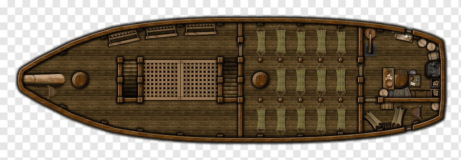

index.html

<html>
<head>
<link rel="stylesheet" href="css/style.css">
</head>

<body>

    

      

      

      

      
    

</body>
</html>

style.css

.con {
  max-width: 600px;
  position: relative;
}

.dot {
  background: red;
  border-radius: 50%;
  height: 20px;
  position: absolute;
  width: 20px;
}

.dot1 {
  top: 40%;
  left: 10%;
}

.dot2 {
  top: 30%;
  right: 20%;
}

.dot3 {
  bottom: 40%;
  left: 50%;
}

img {
  width: 100%;
}
